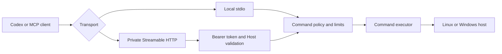

# CommandBridge MCP

[](https://github.com/HsinPu/command-bridge-mcp-server/actions/workflows/ci.yml)
[](https://github.com/HsinPu/command-bridge-mcp-server/tags)
[](package.json)
[](#supported-environments)

**Languages:** English | [繁體中文](README.zh-TW.md)

**Policy-controlled command execution for Linux and Windows through the Model Context Protocol.**

CommandBridge MCP lets Codex and other MCP clients inspect a host and run bounded commands without requiring SSH. It supports local stdio connections and authenticated Streamable HTTP connections for private remote access.

> [!IMPORTANT]
> CommandBridge MCP is currently pre-1.0. Version `v0.2.0` is suitable for evaluation and controlled environments. Review the [security policy](SECURITY.md) before using it on an important host.

## Table of contents

- [Why CommandBridge](#why-commandbridge)
- [Features](#features)
- [Architecture](#architecture)
- [Quick start: Linux systemd](#quick-start-linux-systemd)
- [Connect from Codex](#connect-from-codex)
- [MCP tools](#mcp-tools)
- [Supported environments](#supported-environments)
- [Manual installation](#manual-installation)
- [Configuration](#configuration)
- [Execution policy](#execution-policy)
- [Security](#security)
- [Development](#development)
- [Roadmap](#roadmap)
- [Contributing](#contributing)

## Why CommandBridge

CommandBridge is designed for hosts where SSH is unavailable, undesirable, or too broad for the task.

- **No SSH dependency** — connect through local stdio or a private HTTP route.
- **Cross-platform** — use the same TypeScript server on Linux and Windows.
- **Allowlist-first** — simple diagnostic commands are allowed by default.
- **Explicit privilege boundary** — the Linux service runs without login, sudo, Docker, or extra groups.
- **Bounded execution** — control shells, commands, working directories, timeouts, output, inherited environment variables, and concurrency.
- **Structured results** — receive exit code, stdout, stderr, duration, timeout, and truncation state as MCP structured content.

## Features

| Capability | Behavior |
|---|---|
| Transports | Local stdio and authenticated Streamable HTTP |
| Authentication | Bearer token required for HTTP mode |
| Linux shells | `bash`, `sh`, and optional `pwsh` |
| Windows shells | Windows PowerShell and `cmd.exe` |
| Execution modes | Safe `allowlist` default and explicit `unrestricted` opt-in |
| Host protection | Shell, command, working-directory, timeout, output, environment, and concurrency limits |
| Linux deployment | Versioned `/opt` installation with a hardened systemd service |
| Upgrade safety | Existing configuration is preserved and failed health checks trigger rollback |

## Architecture



Version `v0.2.0` runs one MCP endpoint per host. A future gateway mode is planned for managing multiple outbound-connected host agents.

## Quick start: Linux systemd

The one-command installer supports regular glibc-based Linux distributions using systemd on `x86_64` or `arm64`.

```bash
installer="$(mktemp)" && curl -fsSL https://raw.githubusercontent.com/HsinPu/command-bridge-mcp-server/v0.2.0/install.sh -o "${installer}" && sudo bash "${installer}" && rm -f "${installer}"
```

The installer:

1. Validates the operating system, architecture, systemd, and required tools.
2. Downloads the pinned Node.js runtime and verifies its SHA-256 checksum.
3. Builds and tests the pinned CommandBridge release with a temporary low-privilege account.
4. Installs the application under `/opt/command-bridge-mcp-server`.
5. Creates the dedicated `command-bridge` service account.
6. Creates and enables `command-bridge-mcp-server.service`.
7. Starts the service and verifies `GET /health`.

Verify the installation:

```bash
sudo systemctl is-enabled command-bridge-mcp-server
sudo systemctl status command-bridge-mcp-server --no-pager
curl -fsS http://127.0.0.1:8800/health
```

Follow the service logs:

```bash
sudo journalctl -u command-bridge-mcp-server -f
```

Installed locations:

| Purpose | Path |
|---|---|
| Application and private Node.js runtime | `/opt/command-bridge-mcp-server` |
| Root-owned configuration | `/etc/command-bridge-mcp-server/command-bridge.env` |
| Writable command workspace | `/var/lib/command-bridge-mcp-server/work` |
| systemd unit | `/etc/systemd/system/command-bridge-mcp-server.service` |

See the [Linux systemd installation guide](docs/linux-systemd.md) for prerequisites, review-first installation, remote access, upgrades, and rollback behavior.

> [!NOTE]
> Synology DSM is not a systemd host. Use Container Manager or a DSM-specific package instead.

## Connect from Codex

The Linux installer binds CommandBridge to `127.0.0.1` by default. A Codex client on another machine therefore needs a private route such as Tailscale, Cloudflare Tunnel, or an authenticated TLS reverse proxy.

> [!WARNING]
> Do not expose the built-in HTTP server directly to the public internet. It does not provide TLS.

### 1. Read the generated token on Linux

```bash
sudo awk -F= '$1 == "COMMAND_BRIDGE_BEARER_TOKEN" { print substr($0, index($0, "=") + 1) }' /etc/command-bridge-mcp-server/command-bridge.env
```

Store the token in an environment variable on the Codex client:

```text
COMMAND_BRIDGE_BEARER_TOKEN=<generated-token>
```

### 2. Add the server to Codex

Add the following to `~/.codex/config.toml`:

```toml
[mcp_servers.command_bridge]
enabled = true
url = "https://command-bridge.example.com/mcp"
bearer_token_env_var = "COMMAND_BRIDGE_BEARER_TOKEN"
startup_timeout_sec = 20.0
tool_timeout_sec = 60.0
```

Restart Codex, open `/mcp`, and confirm that `command_bridge` is connected.

Try these prompts:

```text
Use command_bridge_get_system_info to show the Linux host policy.
```

```text
Use command_bridge_run_command to run hostname on the Linux host.
```

## MCP tools

### `command_bridge_get_system_info`

Returns operating-system information and the effective CommandBridge policy.

Key output fields include:

- Hostname, platform, release, and architecture
- Uptime, CPU count, and memory
- Execution mode
- Allowed shells, commands, and working roots
- Maximum parallel command count

This tool is read-only and idempotent.

### `command_bridge_run_command`

Runs one command within the configured policy.

| Input | Required | Description |
|---|:---:|---|
| `command` | Yes | Command text to execute |
| `shell` | No | `bash`, `sh`, `powershell`, or `cmd` |
| `cwd` | No | Working directory under an allowed root |
| `timeoutMs` | No | Requested timeout in milliseconds |

Example input:

```json
{
  "command": "hostname",
  "shell": "bash",
  "cwd": "/var/lib/command-bridge-mcp-server/work",
  "timeoutMs": 15000
}
```

The response includes `ok`, `exitCode`, `stdout`, `stderr`, `durationMs`, `timedOut`, and `truncated`.

The tool is marked as potentially destructive because unrestricted commands can change host state.

## Supported environments

| Environment | Support |
|---|---|
| Linux runtime | `bash`, `sh`, and optional PowerShell 7 through `pwsh` |
| Windows runtime | Windows PowerShell and `cmd.exe` |
| Manual installation | Node.js 20 or newer and npm |
| Linux one-command installer | systemd, glibc, `x86_64` or `arm64`, Linux 4.18+ |
| Alpine and musl Linux | Not currently supported by the systemd installer |

The systemd installer also requires at least 400 MB free under `/opt` and outbound HTTPS access to GitHub, Node.js, and the npm registry.

## Manual installation

Clone and build the project:

```bash
git clone https://github.com/HsinPu/command-bridge-mcp-server.git
cd command-bridge-mcp-server
npm ci
npm run build
```

On Windows PowerShell, use `npm.cmd` if the PowerShell execution policy blocks `npm.ps1`:

```powershell
git clone https://github.com/HsinPu/command-bridge-mcp-server.git
Set-Location command-bridge-mcp-server
npm.cmd ci
npm.cmd run build
```

Copy `.env.example` to `.env`, adjust the policy, and start the server:

```bash
cp .env.example .env
npm start
```

The default transport is stdio. Set `COMMAND_BRIDGE_TRANSPORT=http` and provide a bearer token of at least 32 characters to use Streamable HTTP.

## Configuration

CommandBridge reads configuration from environment variables and supports `.env` during manual development.

| Variable | Default | Description |
|---|---|---|
| `COMMAND_BRIDGE_TRANSPORT` | `stdio` | `stdio` or `http` |
| `COMMAND_BRIDGE_BEARER_TOKEN` | None | Required in HTTP mode; minimum 32 characters |
| `COMMAND_BRIDGE_HTTP_HOST` | `127.0.0.1` | HTTP bind address |
| `COMMAND_BRIDGE_HTTP_PORT` | `8800` | HTTP port |
| `COMMAND_BRIDGE_ALLOWED_HOSTS` | None | Required Host header values for non-loopback binds |
| `COMMAND_BRIDGE_EXECUTION_MODE` | `allowlist` | `allowlist` or `unrestricted` |
| `COMMAND_BRIDGE_ALLOWED_SHELLS` | OS defaults | Comma-separated shell names |
| `COMMAND_BRIDGE_ALLOWED_COMMANDS` | OS defaults | Comma-separated commands allowed in allowlist mode |
| `COMMAND_BRIDGE_ALLOWED_ROOTS` | Startup directory | Working-directory roots separated by the OS path delimiter |
| `COMMAND_BRIDGE_DEFAULT_TIMEOUT_MS` | `15000` | Default command timeout |
| `COMMAND_BRIDGE_MAX_TIMEOUT_MS` | `60000` | Maximum requested timeout |
| `COMMAND_BRIDGE_MAX_OUTPUT_CHARS` | `50000` | Combined stdout and stderr limit |
| `COMMAND_BRIDGE_MAX_PARALLEL_COMMANDS` | `2` | Per-process concurrency limit |
| `COMMAND_BRIDGE_PASSTHROUGH_ENV` | None | Additional environment variable names inherited by commands |

See [.env.example](.env.example) for a copyable configuration template.

## Execution policy

### Allowlist mode

Allowlist mode is the default:

```dotenv
COMMAND_BRIDGE_EXECUTION_MODE=allowlist
```

It:

- Accepts one simple command at a time.
- Rejects pipes, redirects, chaining, command substitution, and newlines.
- Requires the first command name to appear in `COMMAND_BRIDGE_ALLOWED_COMMANDS`.
- Enforces allowed shells, working roots, timeout, output, environment, and concurrency limits.

Default Linux commands:

```text
uname, hostname, whoami, uptime, date, df, free, ps, pwd
```

Default Windows commands:

```text
Get-Date, Get-ComputerInfo, Get-Process, Get-Service, Get-CimInstance,
hostname, whoami, systeminfo, tasklist
```

### Unrestricted mode

```dotenv
COMMAND_BRIDGE_EXECUTION_MODE=unrestricted
```

> [!CAUTION]
> Unrestricted mode permits arbitrary shell syntax and can provide all permissions available to the operating-system account running CommandBridge. Use a dedicated low-privilege account, private networking, and human confirmation in the MCP client.

## Security

Command execution is a sensitive capability. The application policy is only one layer of protection.

- Keep `allowlist` mode unless unrestricted execution is explicitly required.
- Run CommandBridge as a dedicated non-administrator account.
- Use a unique bearer token for every host.
- Keep HTTP access on a private network or behind authenticated TLS.
- Restrict allowed roots and inherited environment variables.
- Never include passwords, API keys, or private keys in command arguments.
- Do not add the Linux service account to `sudo`, `docker`, `adm`, or `systemd-journal`.

`COMMAND_BRIDGE_ALLOWED_ROOTS` restricts the command working directory; it is not a complete filesystem sandbox. An allowed command can still name another path that the operating-system account can read.

Report vulnerabilities through a private [GitHub Security Advisory](https://github.com/HsinPu/command-bridge-mcp-server/security/advisories/new). Do not include secrets or host details in public issues.

Read [SECURITY.md](SECURITY.md) before deploying outside a development environment.

## Development

Install dependencies:

```bash
npm ci
```

Run the development server:

```bash
npm run dev
```

Build:

```bash
npm run build
```

Build and test:

```bash
npm test
```

The test command compiles the TypeScript project and runs the command-policy and Linux installer asset tests.

Project layout:

```text
src/
├── config/          Environment parsing and validation
├── services/        Command policy, execution, and host information
├── tools/           MCP tool registration
└── transport/       Streamable HTTP transport
docs/                Deployment documentation
packaging/systemd/   Hardened Linux systemd unit
install.sh           Version-pinned Linux installer
```

## Roadmap

- Background jobs with polling and cancellation
- Windows service installer
- Structured audit logs with secret redaction
- Central gateway with agent-initiated outbound connections
- OAuth 2.1 for remote MCP clients
- Signed host enrollment and per-host authorization scopes
- Signed prebuilt Linux release artifacts for offline installation

## Contributing

Issues and pull requests are welcome.

1. Open an [issue](https://github.com/HsinPu/command-bridge-mcp-server/issues) for significant behavior or security-boundary changes.
2. Create a focused branch.
3. Run `npm test`.
4. Open a pull request with the motivation, behavior change, and verification evidence.

Use a private [GitHub Security Advisory](https://github.com/HsinPu/command-bridge-mcp-server/security/advisories/new) for vulnerabilities.

---

- [Linux installation guide](docs/linux-systemd.md)
- [Security policy](SECURITY.md)
- [GitHub Actions](https://github.com/HsinPu/command-bridge-mcp-server/actions)
- [Tags](https://github.com/HsinPu/command-bridge-mcp-server/tags)
