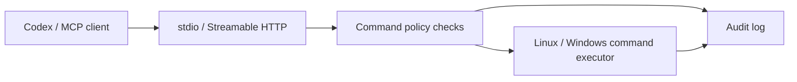

# CommandBridge MCP

**Connect Codex and other MCP clients to Linux and Windows hosts with policy-controlled command execution.**

[](https://github.com/HsinPu/command-bridge-mcp-server/actions/workflows/ci.yml)


[繁體中文](README.zh-TW.md) · [Install](#one-command-installation) · [Connect Codex](#connect-codex) · [Uninstall](#one-command-uninstall) · [Changelog](CHANGELOG.md)

CommandBridge is a [Model Context Protocol (MCP)](https://modelcontextprotocol.io/) server deployed on the host you want to inspect. It gives AI clients a consistent interface for reading host information, running permitted diagnostic commands, and reviewing operation records without requiring SSH as the connection method.

Each host runs its own MCP endpoint. The server supports local `stdio` and remote Streamable HTTP; the one-command installers below create an HTTP background service that starts at boot.

> [!NOTE]
> Installation uses a fixed bootstrap URL and the latest main commit that passed all CI checks, including service installation tests. Tags are optional historical references. Until the first successful install-channel publication, bootstrap fails with a clear error instead of installing an unverified commit. Read the [1.0 migration guide](docs/migration-1.0.md) before upgrading custom allowlists.

## What can you do with it?

| Use case | CommandBridge capability |
| --- | --- |
| Inspect a host | Read operating system details, CPU count, memory, uptime, and effective execution policy. |
| Run diagnostics | Execute allowlisted commands such as `hostname`, `df`, and `Get-Process`. |
| Work across platforms | Use the same MCP tools with each platform's command shell. |
| Review operations | Retrieve redacted command attempts, policy rejections, execution outcomes, and durations. |
| Deploy a persistent service | Download a runtime, build and test the source, install the service, and enable startup at boot. |

## Features

- **One-command deployment:** downloads and builds GitHub source without a preinstalled Git or Node.js.
- **Automatic connection setup:** fresh installs can detect a LAN/Tailscale IPv4 address, configure the listener and allowed Host together, and print a setup block for Codex.
- **Execution policy:** command allowlisting by default, with limits on shells, working directories, timeouts, output, inherited environment variables, and concurrent commands.
- **Audit trail:** records command lifecycle events; commands do not start if the initial audit write fails.
- **Low-privilege services:** a dedicated `command-bridge` account on Linux and `LocalService` on Windows.
- **Configuration preservation:** reinstalls retain configuration and tokens, with recovery mechanisms for failures during upgrade activation.

## How it works



HTTP connections use bearer-token authentication. The service executes commands under a low-privilege account, returns results to the client, and writes operation events to the host's logging system.

## Requirements

| Platform | Environment |
| --- | --- |
| Windows | Windows 10/11 or Windows Server, x64, with an elevated Windows PowerShell session. |
| Linux | x64/ARM64, glibc, systemd as PID 1, and `sudo`; kernel and system libraries must meet the bundled Node.js requirements. |
| Network | Access to GitHub, nodejs.org, and the npm registry during installation; remote clients must be able to reach the host's address and service port. |

Alpine/musl is not supported. The systemd installer cannot run directly on Synology DSM. See the [Linux guide](docs/linux-systemd.md) and [Windows guide](docs/windows-service.md) for complete prerequisites.

## One-command installation

Downloads GitHub source and Node.js, builds and tests the application, starts the service, and enables startup at boot. No preinstalled Git or Node.js is required. Without an explicit URL, a fresh install selects a LAN/Tailscale IPv4 address and prints Codex settings with the IP, port, and token. It falls back to a local-only address if none is found. Existing configuration is preserved.

### Windows

Open Windows PowerShell as administrator (x64) and paste:

~~~powershell
$script = Join-Path $env:TEMP ("command-bridge-" + [guid]::NewGuid() + ".ps1"); try { Invoke-WebRequest -UseBasicParsing -ErrorAction Stop "https://raw.githubusercontent.com/HsinPu/command-bridge-mcp-server/main/scripts/bootstrap.ps1" -OutFile $script; & powershell.exe -NoProfile -ExecutionPolicy Bypass -File $script -PrintCodexSetup; if ($LASTEXITCODE -ne 0) { throw "CommandBridge failed (exit $LASTEXITCODE)." } } finally { Remove-Item -LiteralPath $script -Force -ErrorAction SilentlyContinue }
~~~

### Linux

On a glibc Linux host with systemd (x64/ARM64), paste:

~~~bash
script="$(mktemp)" && curl -fsSL https://raw.githubusercontent.com/HsinPu/command-bridge-mcp-server/main/scripts/bootstrap.sh -o "$script" && sudo bash "$script" --print-codex-setup && rm -f "$script"
~~~

Installation starts `CommandBridgeMCP` on Windows or `command-bridge-mcp-server` on Linux and enables startup after a reboot. The installer checks `/health` to verify that the service responds.

## Connect Codex

After a successful installation, the terminal prints a marked block containing the actual endpoint URL, bearer token, and MCP settings:

```text
========== BEGIN COPY FOR CODEX ==========
MCP URL: http://192.168.1.20:8800/mcp
Bearer token (secret): <generated or preserved token>
...connection settings...
========== END COPY FOR CODEX ==========
```

The IP above is an example. Paste the complete installer-generated block into a trusted Codex task on the client computer and ask it to configure the connection. Do not post the token in public issues or commit it to Git.

**A domain name is not required.** Without an explicit URL, a fresh installation prefers a private IPv4 address on a default-route interface, then looks for other private IPv4 addresses. If none is found, it falls back to `127.0.0.1`, which works only on the same host. Existing configuration files are not automatically changed to a newly detected IP.

Generated HTTP URLs are for a trusted LAN or VPN only. The installer does not provide TLS or open firewall ports. You can specify your own URL for an HTTPS reverse proxy or tunnel. If DHCP changes the address, update the service and client settings. See the platform guides for details.

## MCP tools

| Tool | Purpose |
| --- | --- |
| `command_bridge_get_system_info` | Read host information and effective shell, command, working-directory, and concurrency policies. |
| `command_bridge_run_command` | Execute one command and return stdout, stderr, exit code, duration, and timeout/truncation status. |
| `command_bridge_list_audit_events` | Read recent audit events: 50 by default, up to 100 per request. |

Example requests for a connected client:

> Show this host's system information and currently allowed commands.
>
> Run hostname and tell me the result.
>
> List the last 20 operation records and identify rejected or failed commands.

## Command restrictions and security boundaries

The default `allowlist` mode parses literal arguments, matches an exact approved argv combination, and launches a fixed executable without a shell. Built-in PowerShell cmdlets use a fixed wrapper. Linux defaults include `uname`, `hostname`, `df`, and `ps`; Windows defaults include `Get-Process`, `Get-Service`, and `systeminfo`. Built-ins allow no arguments by default; `Get-CimInstance` uses `Win32_OperatingSystem`. Custom commands require an administrator-managed policy file.

Deletion commands such as `rm`, `del`, and `Remove-Item` are absent from the default policies and are rejected. Enabling a custom native executable policy can permit destructive operations, and `unrestricted` explicitly restores free-form shell execution. Neither mode is a complete filesystem sandbox.

> [!IMPORTANT]
> Administrators must trust the executable and every argument combination they approve. The service must not be able to modify its policy or approved binaries. Working-directory checks resolve symlinks, but arguments can still refer to other accessible paths. Keep the low-privilege account and network restrictions, and do not expose the service directly to the internet. See the [security policy](SECURITY.md).

Service installation defaults:

| Setting | Default |
| --- | --- |
| Execution mode | `allowlist` |
| Shell | Linux: `bash`; Windows: `powershell` |
| HTTP port | `8800` |
| Command timeout | 15 seconds by default, 60-second maximum |
| Output limit | 50,000 characters |
| Concurrent commands | 2 |

## Audit logging

Each command request entering the execution flow first records `attempted`, followed by `blocked`, `completed`, or `failed`. Events include the timestamp, audit ID, redacted command, shell, working directory, source, exit code, and duration.

| Platform | Where to look |
| --- | --- |
| Windows | Event Viewer → Windows Logs → Application, source `CommandBridgeMCP`. |
| Linux | systemd journal for `command-bridge-mcp-server`. |
| MCP client | Call `command_bridge_list_audit_events`. |

Audit events do not store stdout/stderr, and common secret patterns in commands are redacted. Failure to write the initial event prevents execution; failure to write the terminal event withholds captured output. Retention is controlled by the host, and the logs are not tamper-proof.

Local stdio defaults to private JSONL files in the user's data directory, rotating at 10 MiB per file with five files retained. Service installations explicitly select journal or Event Log. The authenticated `/ready` endpoint checks service dependencies; installation also verifies a real MCP command and matching audit lifecycle before discarding upgrade backups.

## One-command uninstall

Stops and removes the service and application, preserving configuration, token, and work data.

### Windows

Open Windows PowerShell as administrator and paste:

~~~powershell
$script = Join-Path $env:TEMP ("command-bridge-" + [guid]::NewGuid() + ".ps1"); try { Invoke-WebRequest -UseBasicParsing -ErrorAction Stop "https://raw.githubusercontent.com/HsinPu/command-bridge-mcp-server/main/scripts/bootstrap.ps1" -OutFile $script; & powershell.exe -NoProfile -ExecutionPolicy Bypass -File $script -Uninstall -Yes; if ($LASTEXITCODE -ne 0) { throw "CommandBridge failed (exit $LASTEXITCODE)." } } finally { Remove-Item -LiteralPath $script -Force -ErrorAction SilentlyContinue }
~~~

### Linux

~~~bash
script="$(mktemp)" && curl -fsSL https://raw.githubusercontent.com/HsinPu/command-bridge-mcp-server/main/scripts/bootstrap.sh -o "$script" && sudo bash "$script" --uninstall --yes && rm -f "$script"
~~~

Detailed settings and full data removal: [Windows guide](docs/windows-service.md) · [Linux guide](docs/linux-systemd.md).

## Documentation and feedback

- [Linux deployment guide](docs/linux-systemd.md): prerequisites, configuration, systemd operations, upgrades, and full removal.
- [Windows deployment guide](docs/windows-service.md): service configuration, Event Log, recovery, and full removal.
- [Environment template](.env.example): configurable environment variables; the application's local default is stdio, which differs from service installation settings.
- [Changelog](CHANGELOG.md): version changes and release status.
- [1.0 migration and policies](docs/migration-1.0.md): exact arguments, custom policies, audit backends, and network refresh.
- [Issues](https://github.com/HsinPu/command-bridge-mcp-server/issues): general problems and feature requests. Include the version, operating system, and error details with secrets removed.
- [Security policy](SECURITY.md): instructions for reporting security issues privately.
