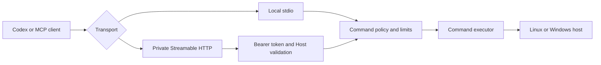

<h1 align="center">CommandBridge MCP</h1>

<p align="center">
  Policy-controlled Linux and Windows command execution for Codex and other MCP clients.
</p>

<p align="center">
  <a href="https://github.com/HsinPu/command-bridge-mcp-server/actions/workflows/ci.yml"></a>
  <a href="https://modelcontextprotocol.io/"></a>
  <a href="#supported-environments"></a>
  <a href="#project-status"></a>
</p>

<p align="center">
  <a href="#quick-start">Quick start</a> ·
  <a href="#connect-codex">Connect Codex</a> ·
  <a href="#mcp-tools">Tools</a> ·
  <a href="docs/linux-systemd.md">Linux guide</a> ·
  <a href="SECURITY.md">Security</a> ·
  <a href="README.zh-TW.md">繁體中文</a>
</p>

---

## Project status

CommandBridge MCP is pre-1.0 and intended for evaluation and controlled environments. It can execute operating-system commands, so review the [security policy](SECURITY.md) before deploying it to an important host.

## What is CommandBridge?

CommandBridge is a cross-platform [Model Context Protocol](https://modelcontextprotocol.io/) server that lets an MCP client inspect a host and run policy-bounded commands without requiring SSH.

It supports local `stdio` connections and private Streamable HTTP connections with bearer-token authentication. The same server runs on Linux and Windows; its execution policy controls shells, command names, working directories, timeouts, output size, inherited environment variables, and concurrent commands.

## Why use it?

| Need | CommandBridge approach |
|---|---|
| No SSH access | Connect through local `stdio` or a private HTTPS route. |
| Safer day-one operations | Start in `allowlist` mode with simple diagnostic commands only. |
| Linux and Windows hosts | Use the same MCP tools with platform-appropriate shells. |
| Controlled remote access | Require a bearer token for HTTP and keep the service behind private networking or authenticated TLS. |
| Predictable automation | Return structured command results, including exit code, output, duration, timeout, and truncation state. |

## Quick start

### Linux systemd

The one-command installer supports common glibc-based Linux distributions that use systemd on `x86_64` or `arm64`.

```bash
installer="$(mktemp)" && curl -fsSL https://raw.githubusercontent.com/HsinPu/command-bridge-mcp-server/v0.3.0/scripts/linux-systemd/install.sh -o "${installer}" && sudo bash "${installer}" --print-codex-setup && rm -f "${installer}"
```

The installer asks for the private HTTPS MCP URL that Codex will use. After the service passes its health check, it prints a marked setup block that can be copied into a trusted Codex task.

If the private route is already known, avoid the interactive prompt:

```bash
installer="$(mktemp)" && curl -fsSL https://raw.githubusercontent.com/HsinPu/command-bridge-mcp-server/v0.3.0/scripts/linux-systemd/install.sh -o "${installer}" && sudo bash "${installer}" --print-codex-setup --codex-url "https://command-bridge.example.com/mcp" && rm -f "${installer}"
```

> [!CAUTION]
> `--print-codex-setup` prints the bearer token. Copy the output only into a trusted Codex task. Do not save it in a repository, ticket, or shared note.

Verify a completed installation:

```bash
sudo systemctl is-enabled command-bridge-mcp-server
sudo systemctl status command-bridge-mcp-server --no-pager
curl -fsS http://127.0.0.1:8800/health
```

For prerequisites, upgrades, rollback behavior, and service operations, see the [Linux systemd installation guide](docs/linux-systemd.md).

> [!NOTE]
> Synology DSM is not a systemd host. Use Container Manager or a DSM-specific package instead.

## Connect Codex

The default Linux service binds to `127.0.0.1`. A Codex client on another machine therefore needs a private route such as Tailscale Serve, Cloudflare Tunnel, or an authenticated TLS reverse proxy.

> [!WARNING]
> The built-in HTTP listener does not provide TLS. Never expose port `8800` directly to the public internet.

### Recommended: copy the installer output

Run the installer with `--print-codex-setup`, then copy everything between `BEGIN COPY FOR CODEX` and `END COPY FOR CODEX` into a trusted Codex task. The block tells Codex to:

1. Store the token as the persistent user environment variable `COMMAND_BRIDGE_BEARER_TOKEN`.
2. Add or update the `command_bridge` entry in `~/.codex/config.toml`.
3. Preserve unrelated Codex settings and report whether a restart is required.
4. Verify the connection through `/mcp` after restarting Codex.

### Manual configuration

If you did not request the copy-ready output, read the token on the Linux host:

```bash
sudo awk -F= '$1 == "COMMAND_BRIDGE_BEARER_TOKEN" { print substr($0, index($0, "=") + 1) }' /etc/command-bridge-mcp-server/command-bridge.env
```

Store it as `COMMAND_BRIDGE_BEARER_TOKEN` on the Codex client, then add this user-level configuration:

```toml
[mcp_servers.command_bridge]
enabled = true
url = "https://command-bridge.example.com/mcp"
bearer_token_env_var = "COMMAND_BRIDGE_BEARER_TOKEN"
startup_timeout_sec = 20.0
tool_timeout_sec = 60.0
```

Restart Codex, open `/mcp`, and confirm that `command_bridge` is connected.

## How it works



Each deployed host runs one MCP endpoint. A future gateway mode is planned for managing multiple outbound-connected host agents.

## MCP tools

| Tool | Purpose | Safety behavior |
|---|---|---|
| `command_bridge_get_system_info` | Returns host information and the effective CommandBridge policy. | Read-only and idempotent. |
| `command_bridge_run_command` | Runs one command using the selected shell and working directory. | Enforces the configured policy; may change host state in `unrestricted` mode. |

Example tool input:

```json
{
  "command": "hostname",
  "shell": "bash",
  "cwd": "/var/lib/command-bridge-mcp-server/work",
  "timeoutMs": 15000
}
```

Command results include `ok`, `exitCode`, `stdout`, `stderr`, `durationMs`, `timedOut`, and `truncated`.

## Installation options

### Manual development installation

```bash
git clone https://github.com/HsinPu/command-bridge-mcp-server.git
cd command-bridge-mcp-server
npm ci
npm run build
cp .env.example .env
npm start
```

On Windows PowerShell, use `npm.cmd` if execution policy blocks `npm.ps1`:

```powershell
git clone https://github.com/HsinPu/command-bridge-mcp-server.git
Set-Location command-bridge-mcp-server
npm.cmd ci
npm.cmd run build
```

The default transport is `stdio`. To use Streamable HTTP, set `COMMAND_BRIDGE_TRANSPORT=http` and provide a bearer token with at least 32 characters.

### Uninstall the Linux service

The standard uninstall preserves the root-owned configuration, bearer token, work data, and low-privilege service account so a later reinstall can reuse them.

```bash
uninstaller="$(mktemp)" && curl -fsSL https://raw.githubusercontent.com/HsinPu/command-bridge-mcp-server/v0.3.0/scripts/linux-systemd/uninstall.sh -o "${uninstaller}" && sudo bash "${uninstaller}" --yes && rm -f "${uninstaller}"
```

Preview its actions without changing the host:

```bash
curl -fsSL https://raw.githubusercontent.com/HsinPu/command-bridge-mcp-server/v0.3.0/scripts/linux-systemd/uninstall.sh -o command-bridge-uninstall.sh
less command-bridge-uninstall.sh
sudo bash command-bridge-uninstall.sh --dry-run
```

> [!CAUTION]
> A full purge permanently removes the configuration, bearer token, work data, and service identity.

```bash
uninstaller="$(mktemp)" && curl -fsSL https://raw.githubusercontent.com/HsinPu/command-bridge-mcp-server/v0.3.0/scripts/linux-systemd/uninstall.sh -o "${uninstaller}" && sudo bash "${uninstaller}" --purge --yes && rm -f "${uninstaller}"
```

## Configuration and execution policy

CommandBridge reads environment variables and also supports `.env` during manual development. See [.env.example](.env.example) for a copyable template.

| Variable | Default | Purpose |
|---|---|---|
| `COMMAND_BRIDGE_TRANSPORT` | `stdio` | Selects `stdio` or `http`. |
| `COMMAND_BRIDGE_BEARER_TOKEN` | None | Required by HTTP mode; minimum 32 characters. |
| `COMMAND_BRIDGE_HTTP_HOST` | `127.0.0.1` | HTTP bind address. |
| `COMMAND_BRIDGE_HTTP_PORT` | `8800` | HTTP port. |
| `COMMAND_BRIDGE_ALLOWED_HOSTS` | None | Required Host values for a non-loopback HTTP bind. |
| `COMMAND_BRIDGE_EXECUTION_MODE` | `allowlist` | Selects `allowlist` or `unrestricted`. |
| `COMMAND_BRIDGE_ALLOWED_SHELLS` | OS defaults | Comma-separated shell names. |
| `COMMAND_BRIDGE_ALLOWED_COMMANDS` | OS defaults | Commands permitted in allowlist mode. |
| `COMMAND_BRIDGE_ALLOWED_ROOTS` | Startup directory | Working-directory roots. |
| `COMMAND_BRIDGE_DEFAULT_TIMEOUT_MS` | `15000` | Default timeout. |
| `COMMAND_BRIDGE_MAX_TIMEOUT_MS` | `60000` | Maximum requested timeout. |
| `COMMAND_BRIDGE_MAX_OUTPUT_CHARS` | `50000` | Combined stdout and stderr limit. |
| `COMMAND_BRIDGE_MAX_PARALLEL_COMMANDS` | `2` | Per-process command concurrency. |
| `COMMAND_BRIDGE_PASSTHROUGH_ENV` | None | Additional inherited environment variable names. |

### Allowlist mode (default)

Allowlist mode permits one simple configured command at a time. It rejects pipes, redirects, chaining, command substitution, and newlines. It also enforces shell, working-directory, timeout, output, environment, and concurrency limits.

Default Linux commands:

```text
uname, hostname, whoami, uptime, date, df, free, ps, pwd
```

Default Windows commands:

```text
Get-Date, Get-ComputerInfo, Get-Process, Get-Service, Get-CimInstance,
hostname, whoami, systeminfo, tasklist
```

### Unrestricted mode

```dotenv
COMMAND_BRIDGE_EXECUTION_MODE=unrestricted
```

> [!CAUTION]
> Unrestricted mode permits arbitrary shell syntax and receives every permission of the operating-system account running CommandBridge. Use a dedicated low-privilege account, private networking, and human confirmation in the MCP client.

## Supported environments

| Environment | Support |
|---|---|
| Linux runtime | `bash`, `sh`, and optional PowerShell 7 through `pwsh` |
| Windows runtime | Windows PowerShell and `cmd.exe` |
| Manual installation | Node.js 20 or newer and npm |
| Linux one-command installer | systemd, glibc, `x86_64` or `arm64`, Linux 4.18+ |
| Alpine and musl Linux | Not supported by the systemd installer |

The Linux installer needs at least 400 MB free under `/opt` and outbound HTTPS access to GitHub, Node.js, and the npm registry.

## Security model

Command execution is a sensitive capability. Application policy is only one layer of protection.

- Keep `allowlist` mode unless unrestricted execution is explicitly required.
- Run CommandBridge as a dedicated non-administrator account.
- Use a unique bearer token for every host and rotate it if exposure is suspected.
- Keep HTTP private or behind authenticated TLS.
- Restrict allowed roots and inherited environment variables.
- Never place passwords, API keys, or private keys in command arguments.
- Do not add the Linux service account to `sudo`, `docker`, `adm`, or `systemd-journal`.

`COMMAND_BRIDGE_ALLOWED_ROOTS` restricts the working directory; it is not a complete filesystem sandbox. An allowed command can still name paths that the service account can read.

Report vulnerabilities through a private [GitHub Security Advisory](https://github.com/HsinPu/command-bridge-mcp-server/security/advisories/new). Do not include secrets, command output, or host details in public issues.

## Development

```bash
npm ci
npm run dev
npm test
```

`npm test` compiles the TypeScript project, then runs command-policy, installer-asset, and uninstaller-asset tests.

```text
src/
├── config/          Environment parsing and validation
├── services/        Command policy, execution, and host information
├── tools/           MCP tool registration
└── transport/       Streamable HTTP transport
docs/                Deployment documentation
packaging/systemd/             Hardened Linux systemd unit
scripts/linux-systemd/
├── install.sh                 Version-pinned Linux installer
└── uninstall.sh               Safe Linux systemd uninstaller
```

## Roadmap

- Background jobs with polling and cancellation
- Windows service installer
- Structured audit logs with secret redaction
- Central gateway with agent-initiated outbound connections
- OAuth 2.1 for remote MCP clients
- Signed host enrollment and per-host authorization scopes
- Signed prebuilt Linux release artifacts for offline installation

## Contributing

Issues and pull requests are welcome.

1. Open an [issue](https://github.com/HsinPu/command-bridge-mcp-server/issues) before a significant behavior or security-boundary change.
2. Create a focused branch.
3. Run `npm test`.
4. Open a pull request that explains the motivation, behavior change, and verification evidence.

Use a private [GitHub Security Advisory](https://github.com/HsinPu/command-bridge-mcp-server/security/advisories/new) for vulnerabilities.

## Links

- [Linux systemd installation guide](docs/linux-systemd.md)
- [Security policy](SECURITY.md)
- [GitHub Actions](https://github.com/HsinPu/command-bridge-mcp-server/actions)
- [Issues](https://github.com/HsinPu/command-bridge-mcp-server/issues)
- [Tags](https://github.com/HsinPu/command-bridge-mcp-server/tags)
