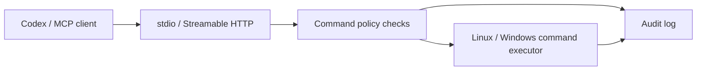

# CommandBridge MCP

**Connect Codex and other MCP clients to Linux and Windows hosts with policy-controlled command execution.**

[](https://github.com/HsinPu/command-bridge-mcp-server/actions/workflows/ci.yml)


[繁體中文](README.zh-TW.md) · [Install](#one-command-installation) · [Connect Codex](#connect-codex) · [Uninstall](#one-command-uninstall) · [Changelog](CHANGELOG.md)

CommandBridge is a [Model Context Protocol (MCP)](https://modelcontextprotocol.io/) server deployed on the host you want to inspect. It gives AI clients a consistent interface for reading host information, running permitted diagnostic commands, and reviewing operation records without requiring SSH as the connection method.

Each host runs its own MCP endpoint. The server supports local `stdio` and remote Streamable HTTP; the one-command installers below create an HTTP background service that starts at boot.

> [!NOTE]
> Installation uses a fixed bootstrap URL and the latest main commit that passed all CI checks, including service installation tests. Tags are optional historical references. Until the first successful install-channel publication, bootstrap fails with a clear error instead of installing an unverified commit. Read the [1.0 migration guide](docs/migration-1.0.md) before upgrading custom allowlists.

## What can you do with it?

| Use case | CommandBridge capability |
| --- | --- |
| Inspect a host | Read operating system details, CPU count, memory, uptime, and effective execution policy. |
| Run diagnostics | Execute allowlisted commands such as `hostname`, `df`, and `Get-Process`. |
| Work across platforms | Use the same MCP tools with each platform's command shell. |
| Review operations | Retrieve redacted command attempts, policy rejections, execution outcomes, and durations. |
| Deploy a persistent service | Download a runtime, build and test the source, install the service, and enable startup at boot. |

## Features

- **One-command deployment:** downloads and builds GitHub source without a preinstalled Git or Node.js.
- **Automatic connection setup:** fresh installs can detect a LAN/Tailscale IPv4 address, configure the listener and allowed Host together, and print a host-specific Codex connection name and token environment variable.
- **Execution policy:** command allowlisting by default, with limits on shells, working directories, timeouts, output, inherited environment variables, and concurrent commands.
- **Audit trail:** records command lifecycle events; commands do not start if the initial audit write fails.
- **Low-privilege services:** a dedicated `command-bridge` account on Linux and `LocalService` on Windows.
- **Configuration preservation:** reinstalls retain configuration and tokens, with recovery mechanisms for failures during upgrade activation.

## How it works


```mermaid
flowchart LR
    Client["Codex / MCP client"] --> Transport["stdio / Streamable HTTP"]
    Transport --> Policy["Command policy checks"]
    Policy --> Executor["Linux / Windows command executor"]
    Policy --> Audit["Audit log"]
    Executor --> Audit
```

HTTP connections use bearer-token authentication. The service executes commands under a low-privilege account, returns results to the client, and writes operation events to the host's logging system.

## Requirements

| Platform | Environment |
| --- | --- |
| Windows | Windows 10/11 or Windows Server, x64, with an elevated Windows PowerShell session. |
| Linux | x64/ARM64, glibc, systemd as PID 1, and `sudo`; kernel and system libraries must meet the bundled Node.js requirements. |
| Network | Access to GitHub, nodejs.org, and the npm registry during installation; remote clients must be able to reach the host's address and service port. |

Alpine/musl is not supported. The systemd installer cannot run directly on Synology DSM. See the [Linux guide](docs/linux-systemd.md) and [Windows guide](docs/windows-service.md) for complete prerequisites.

On SELinux Enforcing/Permissive hosts, the installer requires `restorecon` and `matchpathcon` and repairs deployment labels before starting the service. Version 2.0.3 fixes label repair for Oracle Linux 8.10's `restorecon` options; see the [SELinux recovery guide](docs/linux-systemd.md#selinux-hosts-and-recovery-from-203exec) and [validation status](docs/validation-status.md) before retrying.

## One-command installation

Downloads GitHub source and Node.js, builds and tests the application, starts the service, and enables startup at boot. No preinstalled Git or Node.js is required. Without an explicit URL, a fresh install selects a LAN/Tailscale IPv4 address and prints Codex settings with the IP, port, and token. It falls back to a local-only address if none is found. Existing configuration is preserved.

### Windows

The command explicitly selects guarded on new installs and reinstalls; existing tokens and other settings are preserved.

Open Windows PowerShell as administrator (x64) and paste:

~~~powershell
$script = Join-Path $env:TEMP ("command-bridge-" + [guid]::NewGuid() + ".ps1"); try { Invoke-WebRequest -UseBasicParsing -ErrorAction Stop "https://raw.githubusercontent.com/HsinPu/command-bridge-mcp-server/main/scripts/bootstrap.ps1" -OutFile $script; & powershell.exe -NoProfile -ExecutionPolicy Bypass -File $script -ExecutionMode guarded -PrintCodexSetup; if ($LASTEXITCODE -ne 0) { throw "CommandBridge failed (exit $LASTEXITCODE)." } } finally { Remove-Item -LiteralPath $script -Force -ErrorAction SilentlyContinue }
~~~

### Linux

On a glibc Linux host with systemd (x64/ARM64), run this from your non-root login account. This command runs the service as that account and selects guarded mode on both new installs and reinstalls:

~~~bash
(script="$(mktemp)" && trap 'rm -f -- "$script"' EXIT && curl -fsSL https://raw.githubusercontent.com/HsinPu/command-bridge-mcp-server/main/scripts/bootstrap.sh -o "$script" && sudo bash "$script" --run-as-installer --guarded --print-codex-setup)
~~~

Installation starts `CommandBridgeMCP` on Windows or `command-bridge` on Linux and enables startup after a reboot. The installer checks `/health` to verify that the service responds. Linux installations upgrading from 1.x move to the shorter service and paths; see the [Linux migration guide](docs/linux-systemd.md).

The Linux command above uses `--run-as-installer --guarded`. New installations and reinstalls run as your login account with guarded preflight checks: general commands are available, while recognizable deletion and system modifications are rejected. Existing sudo permissions remain unchanged; no general sudo rights are added. Installation provisions only the fixed-purpose MCP updater authorization described below. This mode does not create a dedicated service user and uses private rotating file Audit. To use the dedicated-account mode on a fresh install, omit `--run-as-installer`.

**Since 3.0.0, each Linux installation selects the execution mode from its options.** Without `--guarded` or `--unrestricted`, it writes `COMMAND_BRIDGE_EXECUTION_MODE=allowlist`, including when upgrading an unrestricted installation. To retain unrestricted execution, explicitly pass `--unrestricted` together with `--run-as-installer` on every install. The README commands explicitly select guarded on reinstall; other settings such as tokens, network settings, custom roots and policy files are preserved; failed validation restores the prior settings. See [Return to allowlist mode](docs/linux-systemd.md#return-to-allowlist-mode). Unrestricted execution remains an explicit advanced choice described in the [platform guide](docs/linux-systemd.md#installer-account-mode); the allowlist is not a complete filesystem sandbox.

Installer-account mode does not create a dedicated `command-bridge` user. After the new service passes MCP/Audit verification, it detects and removes an unused local system account left by older releases, while keeping the policy-reader group and existing data. Unexpected account settings or running processes stop cleanup without deleting the account; see the platform guide for recovery details.

Linux copy-ready commands remove the temporary downloaded script on both success and failure. Installer exit cleanup removes only its own unpromoted deployment staging directories; installed runtimes, releases and data remain. Hard kills or power loss can leave temporary files.

## Connect Codex

After a successful installation, the terminal prints a marked block containing the actual endpoint URL, bearer token, and MCP settings:

```text
========== BEGIN COPY FOR CODEX ==========
MCP URL: http://192.168.1.20:8800/mcp
Codex connection name: cb_twtpelplmap06d
Token environment variable: CB_TWTPELPLMAP06D_TOKEN
Bearer token (secret): <generated or preserved token>
[mcp_servers.cb_twtpelplmap06d]
...connection settings referencing CB_TWTPELPLMAP06D_TOKEN...
========== END COPY FOR CODEX ==========
```

The IP and host name above are examples. Paste the complete installer-generated block into a trusted Codex task on the client computer and ask it to configure the connection. Each host gets a suggested `cb_<hostname>` alias and matching `<UPPERCASE_ALIAS>_TOKEN` client environment variable. If either already belongs to a different host, choose an unused alias and matching token variable without overwriting the existing connection. The installer cannot inspect the client computer; this check happens when applying the printed block. To set a stable or preferred alias, add `--codex-name cb_oracle_prod` on Linux or `-CodexName cb_oracle_prod` on Windows. Names must start with a lowercase letter and contain only lowercase letters, digits, or underscores (up to 64 characters). This changes the Codex client suggestion only; service and MCP tool names stay the same. Do not post the token in public issues or commit it to Git.

**A domain name is not required.** Without an explicit URL, a fresh installation prefers a private IPv4 address on a default-route interface, then looks for other private IPv4 addresses. If none is found, it falls back to `127.0.0.1`, which works only on the same host. Existing configuration files are not automatically changed to a newly detected IP.

Generated HTTP URLs are for a trusted LAN or VPN only. The installer does not provide TLS or open firewall ports. You can specify your own URL for an HTTPS reverse proxy or tunnel. If DHCP changes the address, update the service and client settings. See the platform guides for details.

## Check the installed version

Linux (4.2.0+):

```bash
command-bridge --version
```

Windows PowerShell:

```powershell
& "$env:ProgramFiles\CommandBridgeMCP\command-bridge.cmd" --version
```

`-V` also works. Queries use the bundled runtime and report the locally selected installed release; they do not start MCP/Audit, check service health, or contact GitHub. Older installations must upgrade first. npm users can use either `command-bridge --version` or the existing `command-bridge-mcp-server --version`.

## Update an installed service

From 4.3.0, check the verified CI channel without changing the host:

```bash
command-bridge update --check
```

Update Linux from a separate administrator terminal:

```bash
sudo command-bridge update
```

Windows: run `& "$env:ProgramFiles\CommandBridgeMCP\command-bridge.cmd" update --check`; apply `update` from an elevated PowerShell terminal. Updates preserve the existing service account, execution mode, Token, network, policy and work data. The service briefly restarts, and failed activation restores the previous deployment. Identical source SHA skips rebuilding/restarting. Only `--print-codex-setup` prints the Token. Earlier installations need one upgrade through the existing installer before this command exists. Re-running that installer still selects the execution mode from its arguments; `update` preserves it. npm installations use npm for updates. See the platform guides for details.

## MCP tools

| Tool | Purpose |
| --- | --- |
| `command_bridge_get_system_info` | Read host information and effective shell, command, working-directory, and concurrency policies. |
| `command_bridge_run_command` | Execute one command and return stdout, stderr, exit code, duration, and timeout/truncation status. |
| `command_bridge_list_audit_events` | Read recent audit events: 50 by default, up to 100 per request. |
| `command_bridge_upload_file` | Opt-in upload of a SHA-256 verified file to the private transfer directory; no overwrite. |
| `command_bridge_download_file` | Opt-in download of a regular file with size and SHA-256 metadata. |
| `command_bridge_update` | Request a fixed CI-channel service update; returns an independent job ID. |
| `command_bridge_get_update_status` | Query an update job or the latest job after reconnecting. |

MCP service updates are **enabled by default** on managed Linux/Windows installations. A Bearer Token holder can request an update, causing a brief service interruption. The root/SYSTEM worker accepts no custom source, command or installer arguments; it uses the verified CI channel and existing validation/rollback. Set `COMMAND_BRIDGE_MCP_UPDATE_ENABLED=false` in the saved service configuration to disable requests. Existing installations need one CLI/bootstrap update before these tools are available. npm/stdio installations do not provision a privileged updater. See the [MCP update guide](docs/mcp-update.md).

File transfer is disabled by default, independently of command execution mode. Append `--enable-file-transfer` to Linux installation arguments or `-EnableFileTransfer` on Windows to enable both tools. Each file is limited to 5 MiB; only safe filenames directly inside the managed transfer directory are accepted. No subdirectories, links, URL fetching or automatic execution. See the [file transfer guide](docs/file-transfer.md) for separate permissions, storage, Audit and failure handling.

Example requests for a connected client:

> Show this host's system information and currently allowed commands.
>
> Run hostname and tell me the result.
>
> List the last 20 operation records and identify rejected or failed commands.

## Command restrictions and security boundaries

The default `allowlist` mode parses literal arguments, matches an exact approved argv combination, and launches a fixed executable without a shell. Built-in PowerShell cmdlets use a fixed wrapper. Linux defaults include `uname`, `hostname`, `df`, and `ps`; Windows defaults include `Get-Process`, `Get-Service`, and `systeminfo`. Built-ins allow no arguments by default; `Get-CimInstance` uses `Win32_OperatingSystem`. Custom commands require an administrator-managed policy file.

Deletion commands such as `rm`, `del`, and `Remove-Item` are absent from the default policies and are rejected. Enabling a custom native executable policy can permit destructive operations, and `unrestricted` explicitly restores free-form shell execution. None of the three modes is a complete filesystem sandbox.

> [!IMPORTANT]
> Administrators must trust the executable and every argument combination they approve. The service must not be able to modify its policy or approved binaries. Working-directory checks resolve symlinks, but arguments can still refer to other accessible paths. Keep the low-privilege account and network restrictions, and do not expose the service directly to the internet. See the [security policy](SECURITY.md).

The optional Linux installer-account mode deliberately grants MCP commands that login account's existing access. `--unrestricted` also removes the command allowlist; possession of the bearer token can then trigger any non-interactive command that account can run. Sudo commands requiring a password cannot be completed by the background service.

Service installation defaults:

| Setting | Default |
| --- | --- |
| Runtime mode without configuration | `allowlist` |
| README one-command install mode | `guarded` |
| Shell | Linux: `bash`; Windows: `powershell` |
| HTTP port | `8800` |
| Command timeout | 15 seconds by default, 300-second maximum |
| Output limit | 50,000 characters |
| Concurrent commands | 2 |

Long commands must explicitly request `timeoutMs: 300000` (up to five minutes). Printed Codex setup waits six minutes (`tool_timeout_sec = 360`). Existing timeout settings are preserved on upgrade; see the platform guides to update both the service and client settings.

## Audit logging

Since 4.0.0, an always-on **command preflight guard** rejects recognizable direct writes to CommandBridge's own configuration, policy, application and service assets before starting a process. It applies to all execution modes and returns `SELF_MODIFICATION_BLOCKED` with an attempted/blocked Audit lifecycle. Existing sudo permissions remain unchanged; no privilege broker is introduced. It prevents common accidents, **not indirect modification through scripts, variables, arbitrary programs or external root services**. Manage CommandBridge itself from a separate administrator terminal. See [self-protection and migration](docs/self-protection.md).

Version 4.1.0 adds optional **guarded mode** for general commands: recognizable deletion and system modifications are rejected with a rule and Audit ID. Choose `--guarded` on Linux or `-ExecutionMode guarded` on Windows; the primary installer commands explicitly select guarded from 4.1.2. Ordinary work-file writes and existing sudo permissions remain available. This is accident prevention, not a sandbox; external scripts/programs can bypass inspection and work files may still be overwritten. See [guarded rules and setup](docs/guarded-mode.md).

Each command request entering the execution flow first records `attempted`, followed by `blocked`, `completed`, or `failed`. Events include the timestamp, audit ID, redacted command, shell, working directory, source, exit code, and duration.

| Platform | Where to look |
| --- | --- |
| Windows | Event Viewer → Windows Logs → Application, source `CommandBridgeMCP`. |
| Linux | Default service: systemd journal for `command-bridge`; installer-account service: `/var/lib/command-bridge-installer/CommandBridgeMCP/audit/events.jsonl` (rotating files). |
| MCP client | Call `command_bridge_list_audit_events`. |

Audit events do not store stdout/stderr, and common secret patterns in commands are redacted. Failure to write the initial event prevents execution; failure to write the terminal event withholds captured output. Retention is controlled by the host, and the logs are not tamper-proof.

Local stdio defaults to private JSONL files in the user's data directory, rotating at 10 MiB per file with five files retained. Services select journal, Event Log, or the Linux installer-account file backend. The authenticated `/ready` endpoint checks service dependencies; installation also verifies a real MCP command and matching audit lifecycle before discarding upgrade backups.

From 4.1.16, finished processes release command slots even while terminal Audit is pending. Audit waits are limited to five seconds; a failure stops new commands and file transfers and makes `/ready` fail. Output still requires successful terminal Audit. An underlying disk operation may continue after timeout; resolve storage faults and restart the service before retrying.

## One-command uninstall

Stops and removes the service and application, preserving configuration, token, and work data.

### Windows

Open Windows PowerShell as administrator and paste:

~~~powershell
$script = Join-Path $env:TEMP ("command-bridge-" + [guid]::NewGuid() + ".ps1"); try { Invoke-WebRequest -UseBasicParsing -ErrorAction Stop "https://raw.githubusercontent.com/HsinPu/command-bridge-mcp-server/main/scripts/bootstrap.ps1" -OutFile $script; & powershell.exe -NoProfile -ExecutionPolicy Bypass -File $script -Uninstall -Yes; if ($LASTEXITCODE -ne 0) { throw "CommandBridge failed (exit $LASTEXITCODE)." } } finally { Remove-Item -LiteralPath $script -Force -ErrorAction SilentlyContinue }
~~~

### Linux

~~~bash
(script="$(mktemp)" && trap 'rm -f -- "$script"' EXIT && curl -fsSL https://raw.githubusercontent.com/HsinPu/command-bridge-mcp-server/main/scripts/bootstrap.sh -o "$script" && sudo bash "$script" --uninstall --yes)
~~~

Detailed settings and full data removal: [Windows guide](docs/windows-service.md) · [Linux guide](docs/linux-systemd.md).

## Documentation and feedback

- [Linux deployment guide](docs/linux-systemd.md): prerequisites, configuration, systemd operations, upgrades, and full removal.
- [Windows deployment guide](docs/windows-service.md): service configuration, Event Log, recovery, and full removal.
- [Environment template](.env.example): configurable environment variables; the application's local default is stdio, which differs from service installation settings.
- [Changelog](CHANGELOG.md): version changes and release status.
- [1.0 migration and policies](docs/migration-1.0.md): exact arguments, custom policies, audit backends, and network refresh.
- [Issues](https://github.com/HsinPu/command-bridge-mcp-server/issues): general problems and feature requests. Include the version, operating system, and error details with secrets removed.
- [Security policy](SECURITY.md): instructions for reporting security issues privately.
