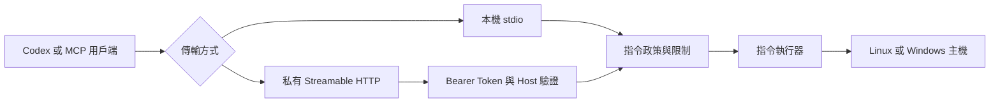

# CommandBridge MCP

[](https://github.com/HsinPu/command-bridge-mcp-server/actions/workflows/ci.yml)
[](https://github.com/HsinPu/command-bridge-mcp-server/tags)
[](package.json)
[](#支援環境)

**語言：** [English](README.md) | 繁體中文

**透過 Model Context Protocol，以政策控制 Linux 與 Windows 指令執行。**

CommandBridge MCP 讓 Codex 與其他 MCP 用戶端不需 SSH，即可檢查主機並執行受限制的指令。它支援本機 stdio 連線，以及使用 Bearer Token 驗證的 Streamable HTTP 私有遠端連線。

> [!IMPORTANT]
> CommandBridge MCP 目前仍是 pre-1.0 專案。`v0.3.0` 適合用於評估與受控環境。在重要主機上使用前，請先閱讀[安全政策](SECURITY.md)。

## 目錄

- [為什麼選擇 CommandBridge](#為什麼選擇-commandbridge)
- [功能](#功能)
- [架構](#架構)
- [快速開始：Linux systemd](#快速開始linux-systemd)
- [一鍵解除安裝](#一鍵解除安裝)
- [從 Codex 連線](#從-codex-連線)
- [MCP 工具](#mcp-工具)
- [支援環境](#支援環境)
- [手動安裝](#手動安裝)
- [設定](#設定)
- [執行政策](#執行政策)
- [安全性](#安全性)
- [開發](#開發)
- [開發藍圖](#開發藍圖)
- [參與貢獻](#參與貢獻)

## 為什麼選擇 CommandBridge

CommandBridge 專為無法使用 SSH、不希望使用 SSH，或 SSH 權限範圍超過實際需求的主機而設計。

- **不依賴 SSH**：透過本機 stdio 或私有 HTTP 路由連線。
- **跨平台**：同一套 TypeScript Server 可在 Linux 與 Windows 上執行。
- **白名單優先**：預設只允許簡單的診斷指令。
- **明確的權限邊界**：Linux 服務帳號沒有登入、sudo、Docker 或額外群組權限。
- **限制執行範圍**：控制 Shell、指令、工作目錄、逾時、輸出、繼承環境變數與並行數量。
- **結構化結果**：透過 MCP structured content 取得結束代碼、stdout、stderr、執行時間、逾時與截斷狀態。

## 功能

| 能力 | 行為 |
|---|---|
| 傳輸方式 | 本機 stdio 與通過驗證的 Streamable HTTP |
| 身分驗證 | HTTP 模式必須使用 Bearer Token |
| Linux Shell | `bash`、`sh`，以及選用的 `pwsh` |
| Windows Shell | Windows PowerShell 與 `cmd.exe` |
| 執行模式 | 安全的預設 `allowlist`，以及明確啟用的 `unrestricted` |
| 主機保護 | 限制 Shell、指令、工作目錄、逾時、輸出、環境變數與並行數量 |
| Linux 部署 | 安裝至版本化的 `/opt` 目錄，並使用強化的 systemd 服務 |
| 升級安全性 | 保留既有設定；健康檢查失敗時回復上一版本 |
| 移除安全性 | 預設保留設定與資料；完整清除必須明確指定 |

## 架構



`v0.3.0` 會在每一台主機上執行一個 MCP Endpoint。未來規劃加入中央 Gateway 模式，管理主動向外連線的多台主機 Agent。

## 快速開始：Linux systemd

一鍵安裝器支援使用 systemd、以 glibc 為基礎的常見 Linux 發行版，CPU 架構可為 `x86_64` 或 `arm64`。

```bash
installer="$(mktemp)" && curl -fsSL https://raw.githubusercontent.com/HsinPu/command-bridge-mcp-server/v0.3.0/install.sh -o "${installer}" && sudo bash "${installer}" && rm -f "${installer}"
```

安裝器會：

1. 驗證作業系統、CPU 架構、systemd 與必要工具。
2. 下載指定版本的 Node.js Runtime，並驗證 SHA-256 Checksum。
3. 使用暫時的低權限帳號，建置並測試指定版本的 CommandBridge。
4. 將應用程式安裝至 `/opt/command-bridge-mcp-server`。
5. 建立專用的 `command-bridge` 服務帳號。
6. 建立並啟用 `command-bridge-mcp-server.service`。
7. 啟動服務並驗證 `GET /health`。

確認安裝結果：

```bash
sudo systemctl is-enabled command-bridge-mcp-server
sudo systemctl status command-bridge-mcp-server --no-pager
curl -fsS http://127.0.0.1:8800/health
```

持續查看服務日誌：

```bash
sudo journalctl -u command-bridge-mcp-server -f
```

安裝位置：

| 用途 | 路徑 |
|---|---|
| 應用程式與私有 Node.js Runtime | `/opt/command-bridge-mcp-server` |
| root 擁有的設定檔 | `/etc/command-bridge-mcp-server/command-bridge.env` |
| 可寫入的指令工作目錄 | `/var/lib/command-bridge-mcp-server/work` |
| systemd Unit | `/etc/systemd/system/command-bridge-mcp-server.service` |

完整的前置需求、安裝前檢查、解除安裝、遠端存取、升級與回復方式，請參考 [Linux systemd 安裝指南](docs/linux-systemd.md)。

> [!NOTE]
> Synology DSM 不是 systemd 主機，請改用 Container Manager 或 DSM 專用套件。

## 一鍵解除安裝

預設解除安裝器會停止並停用服務、移除 systemd Unit，以及刪除 `/opt` 下的應用程式與私有 Node.js Runtime。它會刻意保留 root 擁有的設定、Bearer Token、工作資料與低權限服務帳號，讓日後重新安裝時可以沿用。

```bash
uninstaller="$(mktemp)" && curl -fsSL https://raw.githubusercontent.com/HsinPu/command-bridge-mcp-server/v0.3.0/uninstall.sh -o "${uninstaller}" && sudo bash "${uninstaller}" --yes && rm -f "${uninstaller}"
```

先查看腳本並預覽所有動作，不變更主機：

```bash
curl -fsSL https://raw.githubusercontent.com/HsinPu/command-bridge-mcp-server/v0.3.0/uninstall.sh -o command-bridge-uninstall.sh
less command-bridge-uninstall.sh
sudo bash command-bridge-uninstall.sh --dry-run
```

> [!CAUTION]
> 完整清除會永久刪除 `/etc/command-bridge-mcp-server`、`/var/lib/command-bridge-mcp-server`、Bearer Token、所有 CommandBridge 工作資料，以及專用服務帳號與群組。

```bash
uninstaller="$(mktemp)" && curl -fsSL https://raw.githubusercontent.com/HsinPu/command-bridge-mcp-server/v0.3.0/uninstall.sh -o "${uninstaller}" && sudo bash "${uninstaller}" --purge --yes && rm -f "${uninstaller}"
```

解除安裝器會與安裝器共用操作鎖，在刪除前檢查預期的 systemd Unit 與服務帳號；即使資源已經不存在，也可以再次執行。

## 從 Codex 連線

Linux 安裝器預設讓 CommandBridge 監聽 `127.0.0.1`。因此，其他電腦上的 Codex 用戶端需要透過 Tailscale、Cloudflare Tunnel 或具備身分驗證的 TLS 反向代理等私有路由連線。

> [!WARNING]
> 請勿將內建 HTTP Server 直接公開至網際網路，因為它本身不提供 TLS。

### 1. 在 Linux 讀取產生的 Token

```bash
sudo awk -F= '$1 == "COMMAND_BRIDGE_BEARER_TOKEN" { print substr($0, index($0, "=") + 1) }' /etc/command-bridge-mcp-server/command-bridge.env
```

將 Token 儲存在 Codex 用戶端的環境變數：

```text
COMMAND_BRIDGE_BEARER_TOKEN=<generated-token>
```

### 2. 將 Server 加入 Codex

在 `~/.codex/config.toml` 加入：

```toml
[mcp_servers.command_bridge]
enabled = true
url = "https://command-bridge.example.com/mcp"
bearer_token_env_var = "COMMAND_BRIDGE_BEARER_TOKEN"
startup_timeout_sec = 20.0
tool_timeout_sec = 60.0
```

重新啟動 Codex，開啟 `/mcp`，確認 `command_bridge` 已經連線。

可以使用以下 Prompt 測試：

```text
使用 command_bridge_get_system_info 顯示 Linux 主機的執行政策。
```

```text
使用 command_bridge_run_command 在 Linux 主機執行 hostname。
```

## MCP 工具

### `command_bridge_get_system_info`

回傳作業系統資訊與目前生效的 CommandBridge 執行政策。

主要輸出欄位包括：

- 主機名稱、平台、版本與 CPU 架構
- 運作時間、CPU 數量與記憶體
- 執行模式
- 允許的 Shell、指令與工作目錄根路徑
- 最大並行指令數量

此工具為唯讀且具備冪等性。

### `command_bridge_run_command`

在設定的政策範圍內執行一個指令。

| 輸入 | 必填 | 說明 |
|---|:---:|---|
| `command` | 是 | 要執行的指令文字 |
| `shell` | 否 | `bash`、`sh`、`powershell` 或 `cmd` |
| `cwd` | 否 | 位於允許根路徑下的工作目錄 |
| `timeoutMs` | 否 | 要求的逾時毫秒數 |

輸入範例：

```json
{
  "command": "hostname",
  "shell": "bash",
  "cwd": "/var/lib/command-bridge-mcp-server/work",
  "timeoutMs": 15000
}
```

回應包括 `ok`、`exitCode`、`stdout`、`stderr`、`durationMs`、`timedOut` 與 `truncated`。

由於 unrestricted 指令可能修改主機狀態，此工具被標記為可能具有破壞性。

## 支援環境

| 環境 | 支援狀態 |
|---|---|
| Linux Runtime | `bash`、`sh`，以及透過 `pwsh` 使用選用的 PowerShell 7 |
| Windows Runtime | Windows PowerShell 與 `cmd.exe` |
| 手動安裝 | Node.js 20 或更新版本，以及 npm |
| Linux 一鍵安裝器 | systemd、glibc、`x86_64` 或 `arm64`、Linux 4.18+ |
| Alpine 與 musl Linux | systemd 安裝器目前不支援 |

systemd 安裝器另外需要 `/opt` 至少有 400 MB 可用空間，並能透過 HTTPS 對外連線至 GitHub、Node.js 與 npm Registry。

## 手動安裝

Clone 並建置專案：

```bash
git clone https://github.com/HsinPu/command-bridge-mcp-server.git
cd command-bridge-mcp-server
npm ci
npm run build
```

在 Windows PowerShell 中，如果 PowerShell Execution Policy 封鎖 `npm.ps1`，請使用 `npm.cmd`：

```powershell
git clone https://github.com/HsinPu/command-bridge-mcp-server.git
Set-Location command-bridge-mcp-server
npm.cmd ci
npm.cmd run build
```

將 `.env.example` 複製成 `.env`、調整執行政策，然後啟動 Server：

```bash
cp .env.example .env
npm start
```

預設傳輸方式是 stdio。若要使用 Streamable HTTP，請設定 `COMMAND_BRIDGE_TRANSPORT=http`，並提供至少 32 個字元的 Bearer Token。

## 設定

CommandBridge 從環境變數讀取設定；手動開發時也支援 `.env`。

| 變數 | 預設值 | 說明 |
|---|---|---|
| `COMMAND_BRIDGE_TRANSPORT` | `stdio` | `stdio` 或 `http` |
| `COMMAND_BRIDGE_BEARER_TOKEN` | 無 | HTTP 模式必填；最少 32 個字元 |
| `COMMAND_BRIDGE_HTTP_HOST` | `127.0.0.1` | HTTP Bind Address |
| `COMMAND_BRIDGE_HTTP_PORT` | `8800` | HTTP Port |
| `COMMAND_BRIDGE_ALLOWED_HOSTS` | 無 | 非 Loopback Bind 所允許的 `Host` 標頭值 |
| `COMMAND_BRIDGE_EXECUTION_MODE` | `allowlist` | `allowlist` 或 `unrestricted` |
| `COMMAND_BRIDGE_ALLOWED_SHELLS` | 作業系統預設值 | 以逗號分隔的 Shell 名稱 |
| `COMMAND_BRIDGE_ALLOWED_COMMANDS` | 作業系統預設值 | allowlist 模式允許的指令，以逗號分隔 |
| `COMMAND_BRIDGE_ALLOWED_ROOTS` | 啟動目錄 | 以作業系統路徑分隔符號區隔的工作目錄根路徑 |
| `COMMAND_BRIDGE_DEFAULT_TIMEOUT_MS` | `15000` | 預設指令逾時時間 |
| `COMMAND_BRIDGE_MAX_TIMEOUT_MS` | `60000` | 允許要求的最大逾時時間 |
| `COMMAND_BRIDGE_MAX_OUTPUT_CHARS` | `50000` | stdout 與 stderr 合計字元上限 |
| `COMMAND_BRIDGE_MAX_PARALLEL_COMMANDS` | `2` | 每個 Process 的並行指令上限 |
| `COMMAND_BRIDGE_PASSTHROUGH_ENV` | 無 | 額外允許指令繼承的環境變數名稱 |

可直接複製的設定範本請參考 [.env.example](.env.example)。

## 執行政策

### Allowlist 模式

Allowlist 是預設模式：

```dotenv
COMMAND_BRIDGE_EXECUTION_MODE=allowlist
```

此模式會：

- 一次只接受一個簡單指令。
- 拒絕 Pipe、Redirect、指令串接、Command Substitution 與換行。
- 要求第一個指令名稱必須存在於 `COMMAND_BRIDGE_ALLOWED_COMMANDS`。
- 強制套用 Shell、工作目錄根路徑、逾時、輸出、環境變數與並行數量限制。

Linux 預設指令：

```text
uname, hostname, whoami, uptime, date, df, free, ps, pwd
```

Windows 預設指令：

```text
Get-Date, Get-ComputerInfo, Get-Process, Get-Service, Get-CimInstance,
hostname, whoami, systeminfo, tasklist
```

### Unrestricted 模式

```dotenv
COMMAND_BRIDGE_EXECUTION_MODE=unrestricted
```

> [!CAUTION]
> Unrestricted 模式允許任意 Shell 語法，並可能取得執行 CommandBridge 之作業系統帳號的所有權限。請使用專用的低權限帳號、私有網路，並在 MCP 用戶端保留人工確認。

## 安全性

指令執行是敏感能力，應用程式政策只是其中一層保護。

- 除非明確需要 unrestricted 執行，否則維持 `allowlist` 模式。
- 使用專用的非系統管理員帳號執行 CommandBridge。
- 每一台主機使用不同的 Bearer Token。
- 將 HTTP 存取限制於私有網路，或放在具備身分驗證的 TLS 後方。
- 限制允許的工作目錄根路徑與繼承環境變數。
- 不要在指令參數中加入密碼、API Key 或 Private Key。
- 不要將 Linux 服務帳號加入 `sudo`、`docker`、`adm` 或 `systemd-journal` 群組。

`COMMAND_BRIDGE_ALLOWED_ROOTS` 只限制指令的工作目錄，並不是完整的檔案系統 Sandbox。允許的指令仍可能在參數中指定作業系統帳號有權讀取的其他路徑。

請透過私有 [GitHub Security Advisory](https://github.com/HsinPu/command-bridge-mcp-server/security/advisories/new) 回報漏洞。請勿在公開 Issue 中提供 Secret 或主機資訊。

在開發環境以外部署前，請先閱讀 [SECURITY.md](SECURITY.md)。

## 開發

安裝相依套件：

```bash
npm ci
```

啟動開發 Server：

```bash
npm run dev
```

建置：

```bash
npm run build
```

建置並執行測試：

```bash
npm test
```

測試指令會編譯 TypeScript 專案，然後執行指令政策、Linux 安裝器與解除安裝器資產測試。

專案結構：

```text
src/
├── config/          環境變數解析與驗證
├── services/        指令政策、執行與主機資訊
├── tools/           MCP 工具註冊
└── transport/       Streamable HTTP 傳輸
docs/                部署文件
packaging/systemd/   強化的 Linux systemd Unit
install.sh           鎖定版本的 Linux 安裝器
uninstall.sh         安全的 Linux systemd 解除安裝器
```

## 開發藍圖

- 支援輪詢與取消的背景工作
- Windows 服務安裝器
- 具備 Secret 遮蔽的結構化 Audit Log
- 使用主機 Agent 主動向外連線的中央 Gateway
- 遠端 MCP 用戶端 OAuth 2.1
- 簽章式主機註冊與每台主機的授權範圍
- 適用於離線安裝且具備簽章的預先建置 Linux Release Artifact

## 參與貢獻

歡迎提交 Issue 與 Pull Request。

1. 若要大幅修改行為或安全邊界，請先建立 [Issue](https://github.com/HsinPu/command-bridge-mcp-server/issues)。
2. 建立範圍明確的 Branch。
3. 執行 `npm test`。
4. 建立 Pull Request，說明修改動機、行為變更與驗證證據。

若要回報安全漏洞，請使用私有 [GitHub Security Advisory](https://github.com/HsinPu/command-bridge-mcp-server/security/advisories/new)。

---

- [Linux 安裝指南](docs/linux-systemd.md)
- [安全政策](SECURITY.md)
- [GitHub Actions](https://github.com/HsinPu/command-bridge-mcp-server/actions)
- [Tags](https://github.com/HsinPu/command-bridge-mcp-server/tags)
