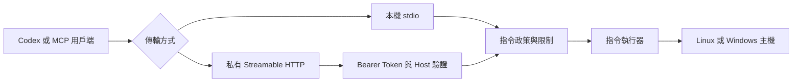

<h1 align="center">CommandBridge MCP</h1>

<p align="center">
  透過 Codex 與其他 MCP 用戶端，以政策控制方式執行 Linux 與 Windows 指令。
</p>

<p align="center">
  <a href="https://github.com/HsinPu/command-bridge-mcp-server/actions/workflows/ci.yml"></a>
  <a href="https://modelcontextprotocol.io/"></a>
  <a href="#支援環境"></a>
  <a href="#專案狀態"></a>
</p>

<p align="center">
  <a href="#快速開始">快速開始</a> ·
  <a href="#連線-codex">連線 Codex</a> ·
  <a href="#mcp-工具">工具</a> ·
  <a href="docs/linux-systemd.md">Linux 安裝指南</a> ·
  <a href="SECURITY.md">安全政策</a> ·
  <a href="README.md">English</a>
</p>

---

## 專案狀態

CommandBridge MCP 目前為 pre-1.0，適用於評估與受控環境。它可以執行作業系統指令；部署到重要主機前，請先閱讀[安全政策](SECURITY.md)。

## CommandBridge 是什麼？

CommandBridge 是一個跨平台的 [Model Context Protocol](https://modelcontextprotocol.io/)（MCP）Server，讓 MCP 用戶端不需 SSH 也能檢查主機並執行受政策限制的指令。

它支援本機 `stdio` 與使用 Bearer Token 驗證的私有 Streamable HTTP。相同的 Server 可在 Linux 與 Windows 執行；執行政策可控制 Shell、指令名稱、工作目錄、逾時、輸出大小、繼承環境變數與同時執行數量。

## 為什麼使用它？

| 需求 | CommandBridge 的做法 |
|---|---|
| 無法使用 SSH | 透過本機 `stdio` 或私人 HTTPS 路由連線。 |
| 想先安全地維運 | 預設採用 `allowlist` 模式，只允許簡單的診斷指令。 |
| 同時管理 Linux 與 Windows | 以相同 MCP 工具搭配各平台合適的 Shell。 |
| 需要受控的遠端存取 | HTTP 強制使用 Bearer Token，並放在私人網路或具驗證的 TLS 後方。 |
| 需要可預期的自動化 | 回傳結構化結果，包括 exit code、輸出、耗時、逾時與截斷狀態。 |

## 快速開始

### Linux systemd

一鍵安裝器支援常見、使用 systemd 的 glibc Linux 發行版，以及 `x86_64` 或 `arm64` CPU 架構。

```bash
installer="$(mktemp)" && curl -fsSL https://raw.githubusercontent.com/HsinPu/command-bridge-mcp-server/v0.3.0/install.sh -o "${installer}" && sudo bash "${installer}" --print-codex-setup && rm -f "${installer}"
```

安裝器會詢問 Codex 要使用的私人 HTTPS MCP 網址。服務通過健康檢查後，會印出一段有明確標記的設定區塊，可直接複製到受信任的 Codex 工作中。

若已知道私人路由網址，可略過互動式詢問：

```bash
installer="$(mktemp)" && curl -fsSL https://raw.githubusercontent.com/HsinPu/command-bridge-mcp-server/v0.3.0/install.sh -o "${installer}" && sudo bash "${installer}" --print-codex-setup --codex-url "https://command-bridge.example.com/mcp" && rm -f "${installer}"
```

> [!CAUTION]
> `--print-codex-setup` 會印出 Bearer Token。只能將輸出貼到受信任的 Codex 工作中，不要儲存在 Repository、工單或共用筆記。

確認安裝完成：

```bash
sudo systemctl is-enabled command-bridge-mcp-server
sudo systemctl status command-bridge-mcp-server --no-pager
curl -fsS http://127.0.0.1:8800/health
```

前置條件、升級、回復與服務操作請參考 [Linux systemd 安裝指南](docs/linux-systemd.md)。

> [!NOTE]
> Synology DSM 並非 systemd 主機。請改用 Container Manager 或 DSM 專用套件。

## 連線 Codex

預設 Linux 服務會綁定在 `127.0.0.1`。若 Codex 用戶端位於另一台電腦，必須建立私人路由，例如 Tailscale Serve、Cloudflare Tunnel，或具驗證的 TLS Reverse Proxy。

> [!WARNING]
> 內建 HTTP Listener 沒有提供 TLS。請勿直接把 `8800` Port 公開到網際網路。

### 建議方式：複製安裝器輸出

安裝時加入 `--print-codex-setup`，再將 `BEGIN COPY FOR CODEX` 到 `END COPY FOR CODEX` 之間的全部內容貼到受信任的 Codex 工作中。該區塊會要求 Codex：

1. 將 Token 儲存成永久的使用者環境變數 `COMMAND_BRIDGE_BEARER_TOKEN`。
2. 在 `~/.codex/config.toml` 新增或更新 `command_bridge`。
3. 保留不相關的 Codex 設定，並說明是否需要重新啟動。
4. 重新啟動 Codex 後，透過 `/mcp` 驗證連線。

### 手動設定

若安裝時未要求輸出可複製區塊，先在 Linux 主機讀取 Token：

```bash
sudo awk -F= '$1 == "COMMAND_BRIDGE_BEARER_TOKEN" { print substr($0, index($0, "=") + 1) }' /etc/command-bridge-mcp-server/command-bridge.env
```

將 Token 儲存在 Codex 用戶端的 `COMMAND_BRIDGE_BEARER_TOKEN`，然後加入下列使用者層級設定：

```toml
[mcp_servers.command_bridge]
enabled = true
url = "https://command-bridge.example.com/mcp"
bearer_token_env_var = "COMMAND_BRIDGE_BEARER_TOKEN"
startup_timeout_sec = 20.0
tool_timeout_sec = 60.0
```

重新啟動 Codex，開啟 `/mcp`，確認 `command_bridge` 已連線。

## 運作方式



每台已部署主機會執行一個 MCP Endpoint。未來規劃加入 Gateway 模式，管理多台由 Agent 主動向外連線的主機。

## MCP 工具

| 工具 | 用途 | 安全行為 |
|---|---|---|
| `command_bridge_get_system_info` | 回傳主機資訊與有效的 CommandBridge 政策。 | 唯讀且具冪等性。 |
| `command_bridge_run_command` | 使用指定 Shell 與工作目錄執行一個指令。 | 強制套用已設定的政策；在 `unrestricted` 模式中可能修改主機狀態。 |

工具輸入範例：

```json
{
  "command": "hostname",
  "shell": "bash",
  "cwd": "/var/lib/command-bridge-mcp-server/work",
  "timeoutMs": 15000
}
```

指令結果會包含 `ok`、`exitCode`、`stdout`、`stderr`、`durationMs`、`timedOut` 與 `truncated`。

## 安裝選項

### 手動開發安裝

```bash
git clone https://github.com/HsinPu/command-bridge-mcp-server.git
cd command-bridge-mcp-server
npm ci
npm run build
cp .env.example .env
npm start
```

若 Windows PowerShell 的執行政策阻擋 `npm.ps1`，請使用 `npm.cmd`：

```powershell
git clone https://github.com/HsinPu/command-bridge-mcp-server.git
Set-Location command-bridge-mcp-server
npm.cmd ci
npm.cmd run build
```

預設傳輸方式為 `stdio`。如需 Streamable HTTP，請設定 `COMMAND_BRIDGE_TRANSPORT=http`，並提供至少 32 個字元的 Bearer Token。

### 解除安裝 Linux 服務

標準解除安裝會保留 root 擁有的設定、Bearer Token、工作資料與低權限服務帳號，讓後續重新安裝可以沿用。

```bash
uninstaller="$(mktemp)" && curl -fsSL https://raw.githubusercontent.com/HsinPu/command-bridge-mcp-server/v0.3.0/uninstall.sh -o "${uninstaller}" && sudo bash "${uninstaller}" --yes && rm -f "${uninstaller}"
```

不變更主機、只預覽操作：

```bash
curl -fsSL https://raw.githubusercontent.com/HsinPu/command-bridge-mcp-server/v0.3.0/uninstall.sh -o command-bridge-uninstall.sh
less command-bridge-uninstall.sh
sudo bash command-bridge-uninstall.sh --dry-run
```

> [!CAUTION]
> 完整清除會永久刪除設定、Bearer Token、工作資料與服務帳號。

```bash
uninstaller="$(mktemp)" && curl -fsSL https://raw.githubusercontent.com/HsinPu/command-bridge-mcp-server/v0.3.0/uninstall.sh -o "${uninstaller}" && sudo bash "${uninstaller}" --purge --yes && rm -f "${uninstaller}"
```

## 設定與執行政策

CommandBridge 從環境變數讀取設定，也支援手動開發時的 `.env`。可複製的設定範本請見 [.env.example](.env.example)。

| 變數 | 預設值 | 用途 |
|---|---|---|
| `COMMAND_BRIDGE_TRANSPORT` | `stdio` | 選擇 `stdio` 或 `http`。 |
| `COMMAND_BRIDGE_BEARER_TOKEN` | 無 | HTTP 模式必填；至少 32 個字元。 |
| `COMMAND_BRIDGE_HTTP_HOST` | `127.0.0.1` | HTTP 綁定位址。 |
| `COMMAND_BRIDGE_HTTP_PORT` | `8800` | HTTP Port。 |
| `COMMAND_BRIDGE_ALLOWED_HOSTS` | 無 | 非 Loopback HTTP 綁定所需的 Host 值。 |
| `COMMAND_BRIDGE_EXECUTION_MODE` | `allowlist` | 選擇 `allowlist` 或 `unrestricted`。 |
| `COMMAND_BRIDGE_ALLOWED_SHELLS` | 作業系統預設值 | 以逗號分隔的 Shell 名稱。 |
| `COMMAND_BRIDGE_ALLOWED_COMMANDS` | 作業系統預設值 | allowlist 模式允許的指令。 |
| `COMMAND_BRIDGE_ALLOWED_ROOTS` | 啟動目錄 | 可使用的工作目錄根路徑。 |
| `COMMAND_BRIDGE_DEFAULT_TIMEOUT_MS` | `15000` | 預設逾時。 |
| `COMMAND_BRIDGE_MAX_TIMEOUT_MS` | `60000` | 最大可要求逾時。 |
| `COMMAND_BRIDGE_MAX_OUTPUT_CHARS` | `50000` | stdout 與 stderr 合計上限。 |
| `COMMAND_BRIDGE_MAX_PARALLEL_COMMANDS` | `2` | 每個 Process 的指令同時執行數。 |
| `COMMAND_BRIDGE_PASSTHROUGH_ENV` | 無 | 額外可繼承的環境變數名稱。 |

### Allowlist 模式（預設）

Allowlist 模式一次只允許一個已設定的簡單指令。它會拒絕 Pipe、Redirect、串接、Command Substitution 與換行，並強制套用 Shell、工作目錄、逾時、輸出、環境變數與同時執行數量限制。

預設 Linux 指令：

```text
uname, hostname, whoami, uptime, date, df, free, ps, pwd
```

預設 Windows 指令：

```text
Get-Date, Get-ComputerInfo, Get-Process, Get-Service, Get-CimInstance,
hostname, whoami, systeminfo, tasklist
```

### Unrestricted 模式

```dotenv
COMMAND_BRIDGE_EXECUTION_MODE=unrestricted
```

> [!CAUTION]
> Unrestricted 模式允許任意 Shell 語法，並取得執行 CommandBridge 的作業系統帳號所擁有的全部權限。請使用專用低權限帳號、私人網路，以及 MCP 用戶端的人為確認。

## 支援環境

| 環境 | 支援狀態 |
|---|---|
| Linux Runtime | `bash`、`sh`，以及選用的 PowerShell 7（`pwsh`） |
| Windows Runtime | Windows PowerShell 與 `cmd.exe` |
| 手動安裝 | Node.js 20 或更新版本，以及 npm |
| Linux 一鍵安裝器 | systemd、glibc、`x86_64` 或 `arm64`、Linux 4.18+ |
| Alpine 與 musl Linux | systemd 安裝器不支援 |

Linux 安裝器另外需要 `/opt` 至少有 400 MB 可用空間，並能透過 HTTPS 連線 GitHub、Node.js 與 npm registry。

## 安全模型

執行指令屬於敏感能力；應用程式政策只是其中一層防護。

- 除非明確需要 unrestricted 執行，否則維持 `allowlist` 模式。
- 將 CommandBridge 以專用、非系統管理員帳號執行。
- 每台主機使用不同的 Bearer Token；若懷疑外洩，立即輪替。
- 將 HTTP 放在私人網路，或具驗證的 TLS 後方。
- 限制允許的工作目錄根路徑與繼承環境變數。
- 不要在指令參數中放入密碼、API Key 或 Private Key。
- 不要將 Linux 服務帳號加入 `sudo`、`docker`、`adm` 或 `systemd-journal` 群組。

`COMMAND_BRIDGE_ALLOWED_ROOTS` 只限制工作目錄，並不是完整的檔案系統 Sandbox。允許的指令仍可指定服務帳號具有讀取權限的其他路徑。

如發現弱點，請透過私密的 [GitHub Security Advisory](https://github.com/HsinPu/command-bridge-mcp-server/security/advisories/new) 回報。請勿在公開 Issue 中包含 Secret、指令輸出或主機細節。

## 開發

```bash
npm ci
npm run dev
npm test
```

`npm test` 會編譯 TypeScript 專案，接著執行指令政策、安裝器資產與解除安裝器資產測試。

```text
src/
├── config/          環境變數解析與驗證
├── services/        指令政策、執行與主機資訊
├── tools/           MCP 工具註冊
└── transport/       Streamable HTTP 傳輸
docs/                部署文件
packaging/systemd/   強化的 Linux systemd Unit
install.sh           版本固定的 Linux 安裝器
uninstall.sh         安全的 Linux systemd 解除安裝器
```

## 開發藍圖

- 支援輪詢與取消的背景工作
- Windows Service 安裝器
- 具 Secret Redaction 的結構化 Audit Log
- Agent 主動向外連線的中央 Gateway
- 遠端 MCP 用戶端的 OAuth 2.1
- 已簽署的主機註冊與每台主機授權範圍
- 支援離線安裝的已簽署 Linux 預先建置 Release Artifact

## 參與貢獻

歡迎提出 Issue 與 Pull Request。

1. 大幅變更行為或安全邊界前，先建立 [Issue](https://github.com/HsinPu/command-bridge-mcp-server/issues)。
2. 建立聚焦的 Branch。
3. 執行 `npm test`。
4. 開啟 Pull Request，說明動機、行為變更與驗證證據。

安全弱點請使用私密的 [GitHub Security Advisory](https://github.com/HsinPu/command-bridge-mcp-server/security/advisories/new)。

## 連結

- [Linux systemd 安裝指南](docs/linux-systemd.md)
- [安全政策](SECURITY.md)
- [GitHub Actions](https://github.com/HsinPu/command-bridge-mcp-server/actions)
- [Issues](https://github.com/HsinPu/command-bridge-mcp-server/issues)
- [Tags](https://github.com/HsinPu/command-bridge-mcp-server/tags)
