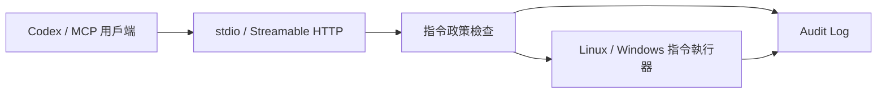

# CommandBridge MCP

**讓 Codex 與其他 MCP 用戶端，透過受政策限制的指令管理 Linux 和 Windows 主機。**

[](https://github.com/HsinPu/command-bridge-mcp-server/actions/workflows/ci.yml)


[English](README.md) · [一鍵安裝](#一鍵安裝) · [連線 Codex](#連線-codex) · [一鍵解除安裝](#一鍵解除安裝) · [更新紀錄](CHANGELOG.md)

CommandBridge 是部署在目標主機上的 [Model Context Protocol（MCP）](https://modelcontextprotocol.io/) Server。透過相同的工具介面，你可以讓 AI 用戶端查看主機資訊、執行允許的診斷指令，並查詢操作紀錄，不需要以 SSH 作為連線方式。

每台主機各自執行一個 MCP Endpoint。服務支援本機 `stdio` 與遠端 Streamable HTTP；下方的一鍵安裝會建立可開機啟動的 HTTP 背景服務。

> [!NOTE]
> 安裝採用固定 bootstrap 網址，來源是通過全部 CI（含真實服務安裝測試）的 main commit，不再要求發布 tag。首次成功建立 install-channel 前，入口會清楚報錯，不會改抓未驗證的版本。自訂過白名單的使用者，升級前請先閱讀 [1.0 遷移指南](docs/migration-1.0.md)。

## 可以做什麼？

| 使用情境 | CommandBridge 提供的能力 |
| --- | --- |
| 了解主機狀況 | 查詢作業系統、CPU 數量、記憶體、開機時間與有效執行政策。 |
| 執行日常診斷 | 執行白名單內的指令，例如 `hostname`、`df`、`Get-Process`。 |
| 同時維護 Linux 與 Windows | 使用一致的 MCP 工具，由各平台的 Shell 執行。 |
| 追查操作結果 | 查詢遮罩後的指令嘗試、政策拒絕、執行結果與耗時。 |
| 部署常駐服務 | 自動下載 Runtime、建置測試、安裝服務並設定開機啟動。 |

## 主要功能

- **一行部署**：不需預先安裝 Git 或 Node.js，從 GitHub 下載原始碼後自動建置。
- **自動連線設定**：新安裝可偵測區網／Tailscale IPv4，同步設定監聽位址與允許的 Host，輸出可交給 Codex 的設定區塊。
- **執行政策**：預設使用指令白名單，另可限制 Shell、工作目錄、逾時、輸出量、環境變數與同時執行數。
- **操作稽核**：記錄執行前後的 Audit 事件；初始稽核寫入失敗時不啟動指令。
- **低權限服務**：Linux 使用專用 `command-bridge` 帳號；Windows 使用 `LocalService`。
- **保留既有設定**：重新安裝會保留設定與 Token；升級流程提供啟用失敗時的回復機制。

## 運作方式



HTTP 連線使用 Bearer Token 驗證。服務在低權限帳號下執行指令，將結果回傳用戶端，並把操作事件寫入主機的日誌系統。

## 安裝需求

| 平台 | 環境 |
| --- | --- |
| Windows | Windows 10／11 或 Windows Server，x64，以系統管理員身分開啟 Windows PowerShell。 |
| Linux | x64／ARM64、glibc、systemd 為 PID 1、可使用 `sudo`；核心與系統函式庫須符合隨附 Node.js 的需求。 |
| 網路 | 安裝時需連到 GitHub、nodejs.org 與 npm registry；遠端用戶端需能到達主機的 IP 和服務 Port。 |

Linux 不支援 Alpine／musl，也不能直接以此 systemd 安裝器部署到 Synology DSM。完整前置條件見 [Linux 指南](docs/linux-systemd.md) 與 [Windows 指南](docs/windows-service.md)。

## 一鍵安裝

自動下載 GitHub 原始碼與 Node.js、建置測試、啟動服務並設定開機啟動，不需先安裝 Git 或 Node.js。未指定網址時，新安裝會自動選用區網／Tailscale IPv4，並印出含 IP、Port 和 Token 的 Codex 連線設定；找不到時退回僅限本機的位址。既有設定會保留。

### Windows

以系統管理員身分開啟 Windows PowerShell（x64），貼上：

~~~powershell
$script = Join-Path $env:TEMP ("command-bridge-" + [guid]::NewGuid() + ".ps1"); try { Invoke-WebRequest -UseBasicParsing -ErrorAction Stop "https://raw.githubusercontent.com/HsinPu/command-bridge-mcp-server/main/scripts/bootstrap.ps1" -OutFile $script; & powershell.exe -NoProfile -ExecutionPolicy Bypass -File $script -PrintCodexSetup; if ($LASTEXITCODE -ne 0) { throw "CommandBridge failed (exit $LASTEXITCODE)." } } finally { Remove-Item -LiteralPath $script -Force -ErrorAction SilentlyContinue }
~~~

### Linux

適用使用 systemd 的 glibc Linux（x64／ARM64），貼上：

~~~bash
script="$(mktemp)" && curl -fsSL https://raw.githubusercontent.com/HsinPu/command-bridge-mcp-server/main/scripts/bootstrap.sh -o "$script" && sudo bash "$script" --print-codex-setup && rm -f "$script"
~~~

安裝完成後，Windows 的 `CommandBridgeMCP` 或 Linux 的 `command-bridge-mcp-server` 服務會啟動，並在重開機後自動啟動。安裝器會檢查 `/health`，確認服務有回應。

## 連線 Codex

安裝成功後，終端機會印出以下標記區塊，包含實際連線網址、Bearer Token 與 MCP 設定：

```text
========== BEGIN COPY FOR CODEX ==========
MCP URL: http://192.168.1.20:8800/mcp
Bearer token (secret): <安裝時產生或保留的 Token>
...連線設定...
========== END COPY FOR CODEX ==========
```

上方 IP 僅為示意。將安裝器印出的完整區塊貼到用戶端電腦上的受信任 Codex 工作，請它依內容設定連線；不要將 Token 貼到公開 Issue 或提交到 Git。

**不需要先填入網域。** 未指定網址的新安裝會優先選用預設路由介面上的私有 IPv4，再尋找其他私有 IPv4；找不到時退回 `127.0.0.1`，只能在同一台主機連線。已存在的設定檔不會被自動換成新 IP。

自動產生的 HTTP 網址僅適用可信任區網或 VPN，不提供 TLS，也不自動開放防火牆。使用 HTTPS 反向代理或 Tunnel 時，可指定自己的連線網址；若 DHCP 改變 IP，需同步更新服務與用戶端設定。細節見平台指南。

## MCP 工具

| 工具 | 功能 |
| --- | --- |
| `command_bridge_get_system_info` | 取得主機資訊及目前的 Shell、指令白名單、工作目錄與並行限制。 |
| `command_bridge_run_command` | 執行一個指令，回傳 stdout、stderr、exit code、耗時與逾時／截斷狀態。 |
| `command_bridge_list_audit_events` | 查詢最近的 Audit 事件，預設 50 筆，最多 100 筆。 |

例如，你可以請已連線的用戶端：

> 查看這台主機的系統資訊與目前允許的指令。
>
> 執行 hostname，並告訴我結果。
>
> 列出最近 20 筆操作紀錄，指出哪些指令被拒絕或執行失敗。

## 指令限制與安全邊界

預設為 `allowlist`，只解析字面參數、比對完整且精確的 argv 組合，直接啟動固定程式，不交給 Shell 二次解析。PowerShell Cmdlet 使用固定包裝程式。Linux 預設包含 `uname`、`hostname`、`df`、`ps`；Windows 包含 `Get-Process`、`Get-Service`、`systeminfo`。內建指令預設允許無參數呼叫；`Get-CimInstance` 查詢 `Win32_OperatingSystem`。自訂指令需由管理員建立政策檔。

`rm`、`del`、`Remove-Item` 不在預設政策中，會被拒絕。自訂原生程式政策仍可能允許破壞性操作；明確啟用 `unrestricted` 則恢復自由 Shell 指令。兩種模式都不是完整檔案系統沙箱。

> [!IMPORTANT]
> 管理員必須信任所核准的程式與每組參數；服務帳號不應能修改政策或核准的程式。工作目錄檢查會解析 symlink，但參數仍可存取其他有權限的路徑。請保留低權限帳號與網路限制，不要把服務直接公開到網際網路。詳見 [安全政策](SECURITY.md)。

服務安裝的預設限制：

| 項目 | 預設值 |
| --- | --- |
| 執行模式 | `allowlist` |
| Shell | Linux：`bash`；Windows：`powershell` |
| HTTP Port | `8800` |
| 指令逾時 | 預設 15 秒，上限 60 秒 |
| 輸出限制 | 50,000 字元 |
| 同時執行數 | 2 |

## 操作紀錄

每次進入執行流程的指令請求先記錄 `attempted`，結束後記錄 `blocked`、`completed` 或 `failed`。事件包含時間、Audit ID、遮罩後的指令、Shell、工作目錄、來源、exit code 與耗時。

| 平台 | 查看位置 |
| --- | --- |
| Windows | 事件檢視器 → Windows 記錄 → 應用程式，來源 `CommandBridgeMCP`。 |
| Linux | systemd journal，服務 `command-bridge-mcp-server`。 |
| MCP 用戶端 | 呼叫 `command_bridge_list_audit_events`。 |

Audit 不保存 stdout／stderr，指令中的常見秘密格式會遮罩。初始寫入失敗時不執行指令；終結事件寫入失敗時不回傳擷取的輸出。保存期限由主機設定決定，日誌不具不可竄改保證。

本機 stdio 預設改用使用者資料目錄內的私有 JSONL 檔案，每檔 10 MiB、保留五份；服務安裝則明確選用 journal／Event Log。需驗證 Token 的 `/ready` 會檢查服務依賴；安裝器還會透過真實 MCP 執行指令並核對 Audit lifecycle，通過後才移除升級備份。

## 一鍵解除安裝

停止並移除服務與程式，保留設定、Token 和工作資料。

### Windows

以系統管理員身分開啟 Windows PowerShell，貼上：

~~~powershell
$script = Join-Path $env:TEMP ("command-bridge-" + [guid]::NewGuid() + ".ps1"); try { Invoke-WebRequest -UseBasicParsing -ErrorAction Stop "https://raw.githubusercontent.com/HsinPu/command-bridge-mcp-server/main/scripts/bootstrap.ps1" -OutFile $script; & powershell.exe -NoProfile -ExecutionPolicy Bypass -File $script -Uninstall -Yes; if ($LASTEXITCODE -ne 0) { throw "CommandBridge failed (exit $LASTEXITCODE)." } } finally { Remove-Item -LiteralPath $script -Force -ErrorAction SilentlyContinue }
~~~

### Linux

~~~bash
script="$(mktemp)" && curl -fsSL https://raw.githubusercontent.com/HsinPu/command-bridge-mcp-server/main/scripts/bootstrap.sh -o "$script" && sudo bash "$script" --uninstall --yes && rm -f "$script"
~~~

詳細設定與完整清除方式：[Windows 指南](docs/windows-service.md) · [Linux 指南](docs/linux-systemd.md)。

## 文件與回報

- [Linux 部署指南](docs/linux-systemd.md)：前置條件、設定、systemd 操作、升級與完整移除。
- [Windows 部署指南](docs/windows-service.md)：服務設定、Event Log、回復與完整移除。
- [設定範本](.env.example)：可調整的環境變數；本機程式的預設傳輸為 stdio，與服務安裝設定不同。
- [更新紀錄](CHANGELOG.md)：版本變更與發布狀態。
- [1.0 遷移與政策指南](docs/migration-1.0.md)：精確參數、自訂政策、Audit 後端與網路重設。
- [Issues](https://github.com/HsinPu/command-bridge-mcp-server/issues)：一般問題與功能建議；請附上版本、作業系統及去除秘密後的錯誤資訊。
- [安全政策](SECURITY.md)：安全問題請依文件以私下方式回報。
